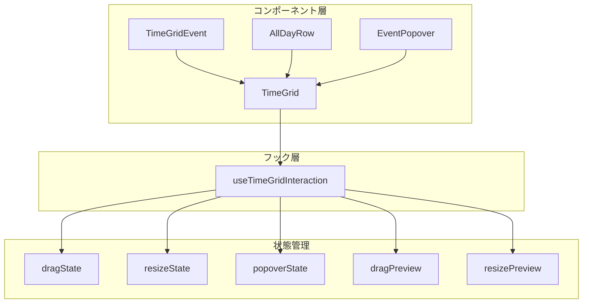
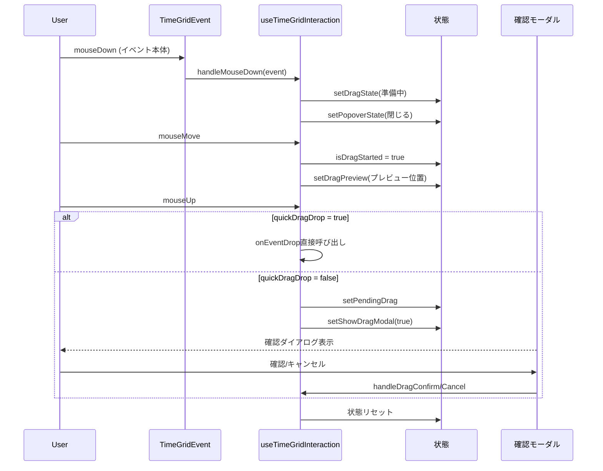
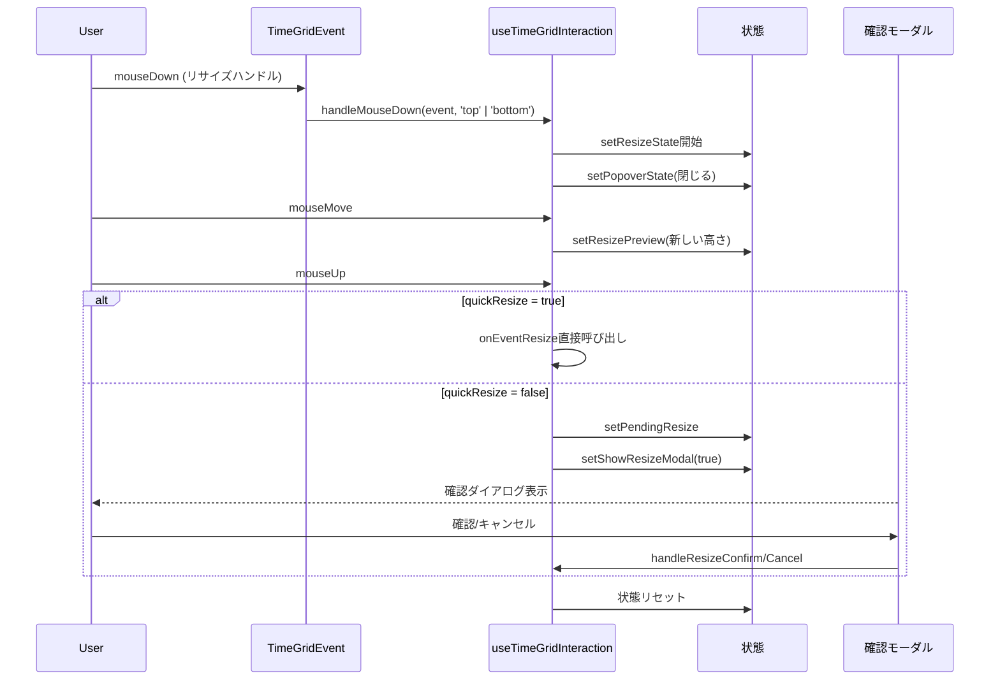
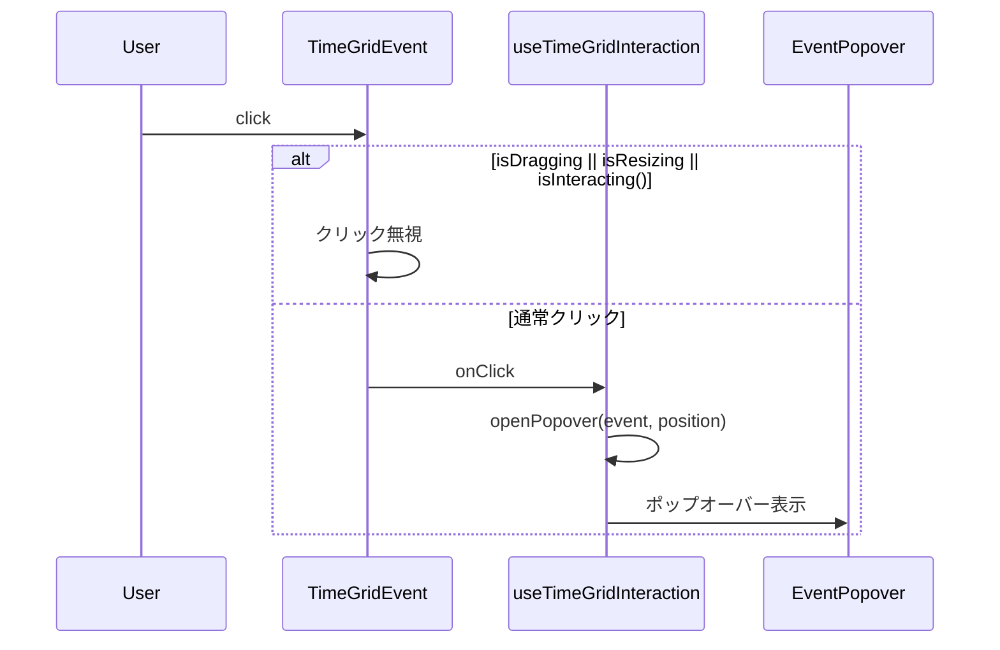
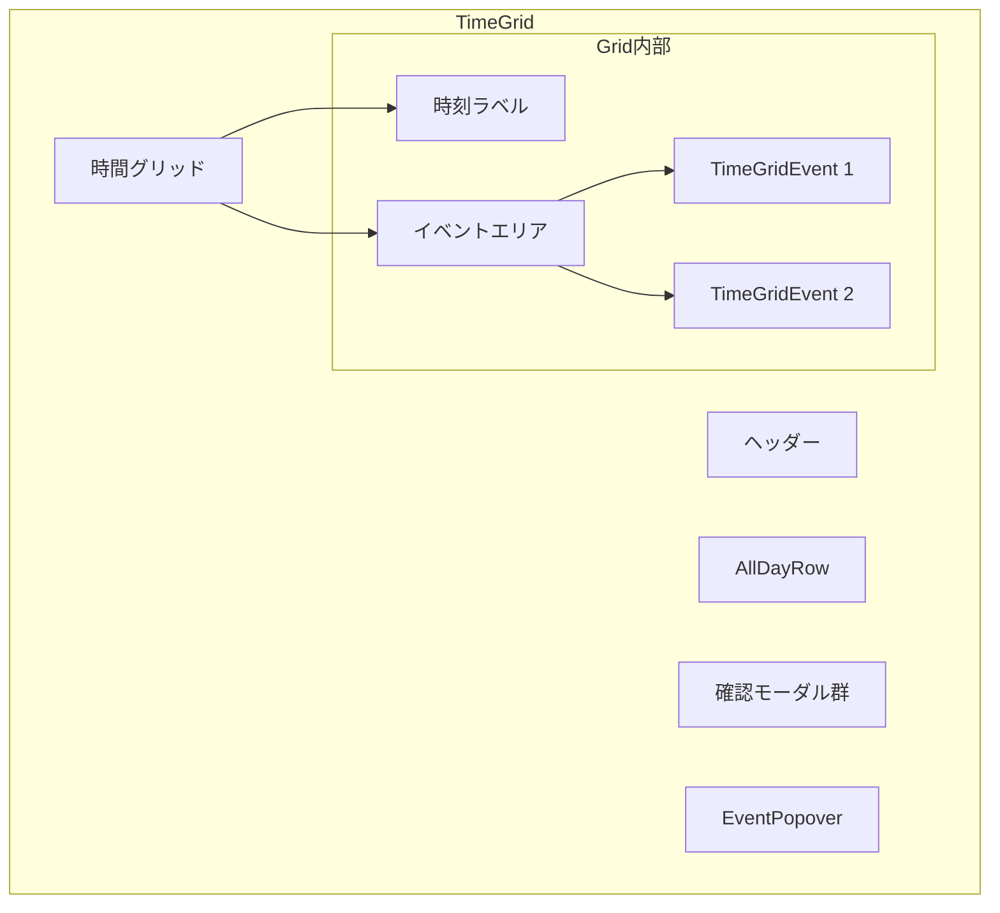
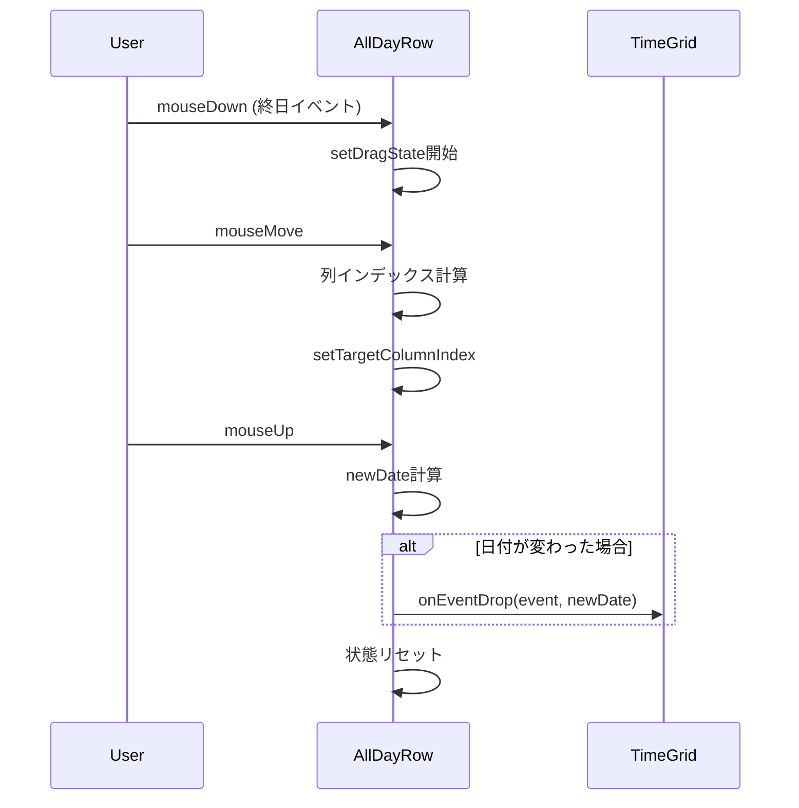

# イベントハンドリング アーキテクチャ

カレンダーコンポーネントにおけるイベント操作（ドラッグ＆ドロップ、リサイズ、クリック）の設計ドキュメント。

## 概要



## 状態の種類

### 1. ドラッグ状態 (EventDragState)

```typescript
interface EventDragState {
  isDragging: boolean
  draggedEvent: CalendarEvent | null
  dragOffset: { x: number; y: number }
  originalDate: Date
}
```

### 2. リサイズ状態 (EventResizeState)

```typescript
interface EventResizeState {
  isResizing: boolean
  resizedEvent: CalendarEvent | null
  resizeHandle: 'top' | 'bottom' | null
  originalHeight: number
}
```

### 3. ポップオーバー状態 (PopoverState)

```typescript
interface PopoverState {
  isOpen: boolean
  event: CalendarEvent | null
  position: { x: number; y: number }
}
```

## イベントフロー

### ドラッグ操作



### リサイズ操作



### クリック操作（ポップオーバー）



## コンポーネント構成



## useTimeGridInteraction フック

### 入力

| プロパティ | 型 | 説明 |
|-----------|------|------|
| `dates` | `Date[]` | 表示する日付配列 |
| `config` | `CalendarConfig` | カレンダー設定 |
| `gridRef` | `React.RefObject` | グリッドDOM参照 |
| `onEventDrop` | `function` | ドロップ時コールバック |
| `onEventResize` | `function` | リサイズ時コールバック |

### 出力

| プロパティ | 説明 |
|-----------|------|
| `state` | 全状態（drag/resize/popover/preview/modal） |
| `handlers` | マウスイベントハンドラー |
| `actions` | ポップオーバー操作アクション |
| `modalHandlers` | モーダル確認/キャンセルハンドラー |

## クリック vs ドラッグ判定

ドラッグ/リサイズ終了後にクリックイベントが発火する問題を防ぐため、`interactionEndTimeRef`を使用：

```typescript
const interactionEndTimeRef = useRef<number>(0)

const isInteracting = () => {
  return (
    dragState.isDragging ||
    resizeState.isResizing ||
    Date.now() - interactionEndTimeRef.current < 100
  )
}
```

mouseUp後100ms以内のクリックは無視される。

## 設定オプション

| オプション | デフォルト | 説明 |
|-----------|-----------|------|
| `quickDragDrop` | `false` | `true`: 即座にドロップ確定、`false`: 確認モーダル表示 |
| `quickResize` | `false` | `true`: 即座にリサイズ確定、`false`: 確認モーダル表示 |
| `enableDragDrop` | `true` | ドラッグ＆ドロップ有効化 |
| `enableResize` | `true` | リサイズ有効化 |

## AllDayRow ドラッグ

終日イベントは`AllDayRow`コンポーネント内で独自のドラッグ機能を持つ：



## ファイル構成

```
src/
├── lib/
│   ├── hooks/
│   │   └── use-time-grid-interaction.ts  # メインフック
│   └── constants.ts                       # TIME_SLOT_HEIGHT等
└── components/
    └── calendar/
        ├── time-grid.tsx                  # グリッドコンポーネント
        ├── time-grid-event.tsx            # イベントコンポーネント
        ├── all-day-row.tsx                # 終日イベント行
        ├── event-popover.tsx              # ポップオーバー
        ├── event-resize-modal.tsx         # リサイズ確認
        └── event-move-modal.tsx           # 移動確認
```
