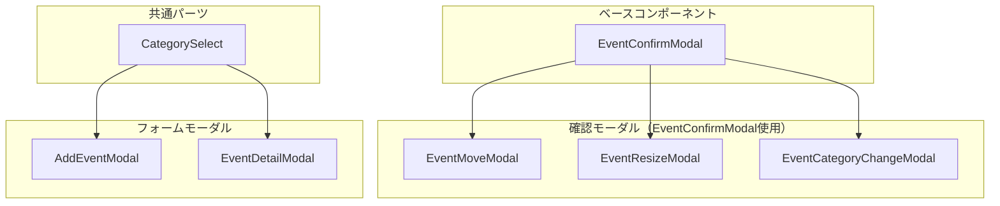

# モーダルコンポーネント アーキテクチャ

カレンダーアプリケーションで使用されるモーダルコンポーネントの設計ドキュメント。

## コンポーネント構成



## ファイル一覧

| ファイル | 用途 |
|---------|------|
| [event-confirm-modal.tsx](../src/components/calendar/event-confirm-modal.tsx) | 確認モーダルのベース |
| [event-move-modal.tsx](../src/components/calendar/event-move-modal.tsx) | イベント移動確認 |
| [event-resize-modal.tsx](../src/components/calendar/event-resize-modal.tsx) | リサイズ確認 |
| [event-category-change-modal.tsx](../src/components/calendar/event-category-change-modal.tsx) | カテゴリ変更確認 |
| [add-event-modal.tsx](../src/components/calendar/add-event-modal.tsx) | イベント新規作成 |
| [event-detail-modal.tsx](../src/components/calendar/event-detail-modal.tsx) | イベント詳細/編集 |
| [category-select.tsx](../src/components/calendar/category-select.tsx) | カテゴリ選択（共通） |

---

## EventConfirmModal（ベース）

操作確認モーダルの共通UI。子コンポーネントで内容をカスタマイズ。

```typescript
interface EventConfirmModalProps {
  isOpen: boolean
  title: string
  event: CalendarEvent | null
  categoryColors?: CategoryColor[]
  confirmLabel: string
  cancelLabel: string
  children: ReactNode  // カスタムコンテンツ
  onConfirm: () => void
  onCancel: () => void
}
```

**機能:**
- バックドロップ（クリックで閉じる）
- Escキーで閉じる
- `getEventStyle`でカテゴリ色反映
- 確認/キャンセルボタン

---

## CategorySelect（共通パーツ）

カテゴリ選択UIをAddEventModal/EventDetailModalで共有。

```typescript
interface CategorySelectProps {
  value: string
  categories: CategoryColor[]
  language: Language
  onChange: (value: string) => void
  showLabel?: boolean
}
```

**機能:**
- カテゴリがあればSelect表示
- なければInputにフォールバック
- 色付きドット表示

---

## 使用フロー

### イベント移動時
```
TimeGrid → handleDragConfirm → EventMoveModal表示
         → 確認 → onEventDropコールバック
```

### イベントリサイズ時
```
TimeGrid → handleResizeConfirm → EventResizeModal表示
         → 確認 → onEventResizeコールバック
```

### カテゴリ変更時（CategoryView）
```
CategoryView → handleEventDrop → EventCategoryChangeModal表示
             → 確認 → onEventCategoryChangeコールバック
```

### イベント作成時
```
カレンダー空白クリック → AddEventModal表示
                      → 入力 → onCreateコールバック
```

### イベント編集時
```
イベントクリック → EventPopover → 詳細クリック
                              → EventDetailModal表示
                              → 編集 → onUpdateコールバック
```
